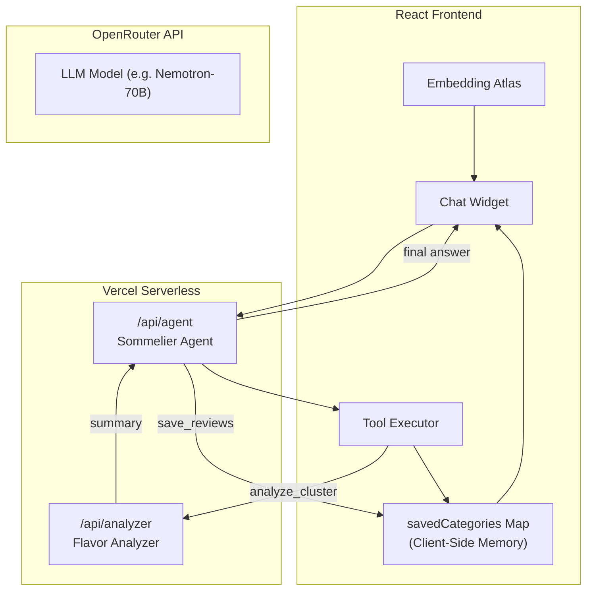
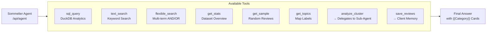
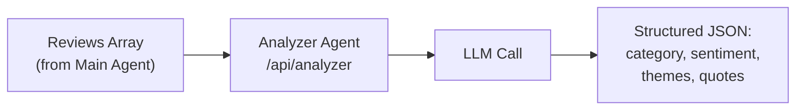

# Wine Review Atlas - Sommelier AI Agent

An interactive visualization and analysis tool for **130k Wine Reviews** using Apple's Embedding Atlas with an AI-powered Multi-Agent system.

## Sommelier Agent Demo

The web app features a sophisticated **Multi-Agent Architecture** that enables autonomous exploration of the wine landscape, acting as your personal AI Sommelier.

### Features

| Feature             | Description                                                                               |
| ------------------- | ----------------------------------------------------------------------------------------- |
| **Sommelier Agent** | **Orchestrator Agent** that understands varietals, regions, and price points              |
| **Flavor Analyzer** | **Analyzer Agent** that extracts flavor notes, acidity, tannins, and finish from clusters |
| **Agentic Search**  | Autonomous exploration loop: Scan Regions → Analyze Flavors → Select Best Wines           |
| **Vintage Memory**  | Bookmarks interesting wines with **Category Cards** (e.g., "Earthy Tuscan Reds")          |
| **Interactive Map** | 2D semantic map of 130k wines where similar taste profiles are clustered together         |

### How It Works

1.  **Global Scan**: The Sommelier scans the map for dense clusters of unrelated wines or specific varietals.
2.  **Delegated Analysis**: It delegates specific clusters to the **Analyzer Agent** to extract flavor profiles.
3.  **Synthesis**: The Analyzer returns a structured summary (tasting notes, quality sentiment, representative quotes).
4.  **Curation**: Relevant wines are saved as curated collections in the chat.
5.  **Presentation**: The final answer displays interactive **Category Cards** allowing you to browse specific bottles.

### Architecture

#### Main Agent (Sommelier)

The orchestrator agent that coordinates exploration and delegates analysis tasks.

#### Sub-Agent (Analyzer)

A specialized sub-agent that receives review data and extracts structured insights.

## Capabilities

- **Semantic Search**: Find wines by description (e.g., "barnyard funk", "cat pee on a gooseberry bush").
- **SQL Analytics**: Aggregate stats by price, points (80-100), country, or winery via DuckDB-WASM.
- **Cluster Inspector**: Deep dive into specific map regions to understand local styles.
- **Value Finder**: Identify high-scoring wines at low price points.

### Example Questions

- "Find me some bold red wines under $20 that taste like chocolate."
- "What are the main differences between the Pinot Noirs in the top-left vs bottom-right clusters?"
- "Show me the rating distribution for French wines."
- "I like earthy, tannic wines. What do you recommend?"

## Tech Stack

| Component     | Technology                               |
| ------------- | ---------------------------------------- |
| Visualization | Apple Embedding Atlas                    |
| Embeddings    | Qwen 3 (4B) via OpenRouter               |
| Data Engine   | DuckDB-WASM + Mosaic                     |
| Frontend      | React + TypeScript + Vite                |
| Backend       | Vercel Serverless Functions              |
| AI Agents     | Orchestrator + Analyzer (via OpenRouter) |
| Dataset       | Wine Magazine (130k reviews)             |

## Data Pipeline

The project includes a robust Python pipeline to process the raw CSV into a visualization-ready format:

1.  `1_generate_embeddings_OpenRouter.py` - Generate embeddings from wine descriptions using Nomic API.
2.  `2_reduce_dimensions.py` - Dimensionality reduction (UMAP) to project 768d vectors to 2D.
3.  `regenerate_static_export.py` - Packages the processed `winemag_projected.parquet` for the web app.

## License

This project is licensed for **non-commercial use only**.

For commercial use, please contact the author for permission.

See [LICENSE](LICENSE) for details.
