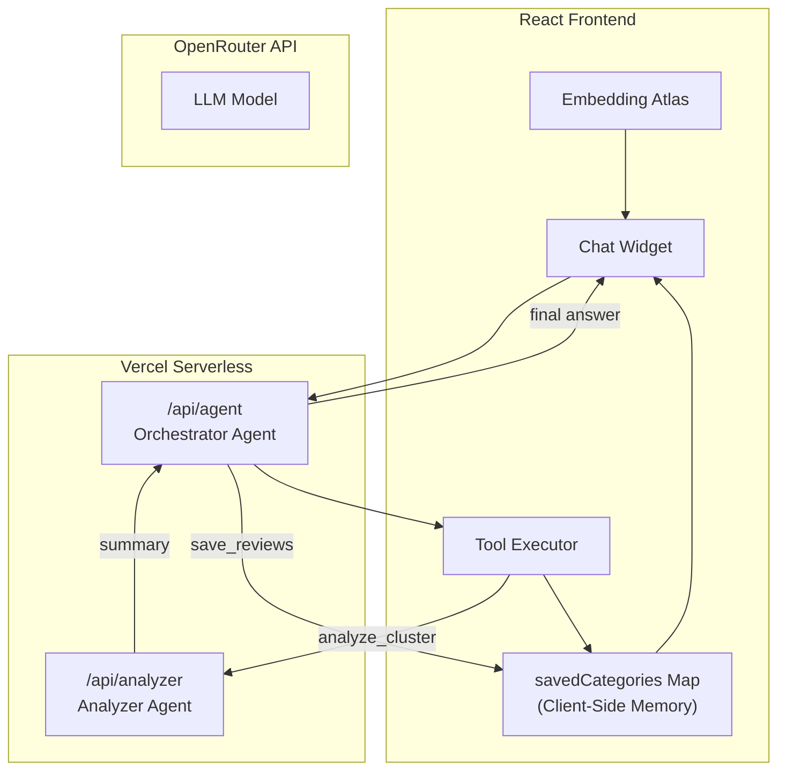

# Embedding Atlas - TripAdvisor Reviews Visualization

An interactive visualization and analysis tool for TripAdvisor hotel reviews using Apple's Embedding Atlas with an AI-powered Multi-Agent system.

## Atlas Agent Demo

https://github.com/user-attachments/assets/75c8c0f0-cefe-4447-abb4-21fa4c1ade23

## Multi-Agent Agentic Search

The web app features a sophisticated **Multi-Agent Architecture** that enables autonomous data exploration and deep analysis without overwhelming the LLM's context window.

### Features

| Feature                   | Description                                                                              |
| ------------------------- | ---------------------------------------------------------------------------------------- |
| **Multi-Agent System**    | **Orchestrator Agent** plans strategy; **Analyzer Agent** performs deep cluster analysis |
| **Agentic Search**        | Autonomous exploration loop: Scan → Analyze → Evaluate → Save                            |
| **Category Cards**        | Rich UI cards displaying themes, sentiment, ratings, and scrollable review samples       |
| **Context Efficiency**    | Analyzes hundreds of reviews while keeping the main agent's context lightweight          |
| **Client-Side Hydration** | Review details are hydrated on the client side, bypassing LLM token limits               |

### How It Works

1. **Global Scan**: The Orchestrator scans the map for dense clusters of reviews.
2. **Delegated Analysis**: It delegates specific clusters to the **Analyzer Agent** (`analyze_cluster`).
3. **Synthesis**: The Analyzer returns a structured summary (themes, sentiment, quotes).
4. **Memory**: Relevant findings are bookmarked (`save_reviews`) and stored in client-side memory.
5. **Presentation**: The final answer uses `{{Category}}` placeholders which expand into interactive **Category Cards** showing full review details.

### Architecture

## Capabilities

- **SQL Queries**: aggregations, filters, grouping via DuckDB-WASM
- **Cluster Analysis**: Deep dive into specific map regions
- **Review Saving**: Bookmark 15+ samples per category for user review
- **Text Search**: Keyword matching
- **Statistics**: Rating distributions and counts

### Example Questions

- "What are the main complaints in these hotel reviews?"
- "Find positive feedback about breakfast and save examples."
- "Analyze the cluster of negative reviews at the top left."
- "Compare the service quality between business and family travelers."

## Tech Stack

| Component     | Technology                               |
| ------------- | ---------------------------------------- |
| Visualization | Apple Embedding Atlas                    |
| Embeddings    | Nomic Embed V1.5                         |
| Data Engine   | DuckDB-WASM + Mosaic                     |
| Frontend      | React + TypeScript + Vite                |
| Backend       | Vercel Serverless Functions              |
| AI Agents     | Orchestrator + Analyzer (via OpenRouter) |

## Data Pipeline

1. `1_generate_embeddings_*.py` - Generate embeddings from review text
2. `2_reduce_dimensions.py` - UMAP projection to 2D
3. `3_visualize_atlas*.py` - Interactive visualization

## License

This project is licensed for **non-commercial use only**.

For commercial use, please contact the author for permission.

See [LICENSE](LICENSE) for details.
