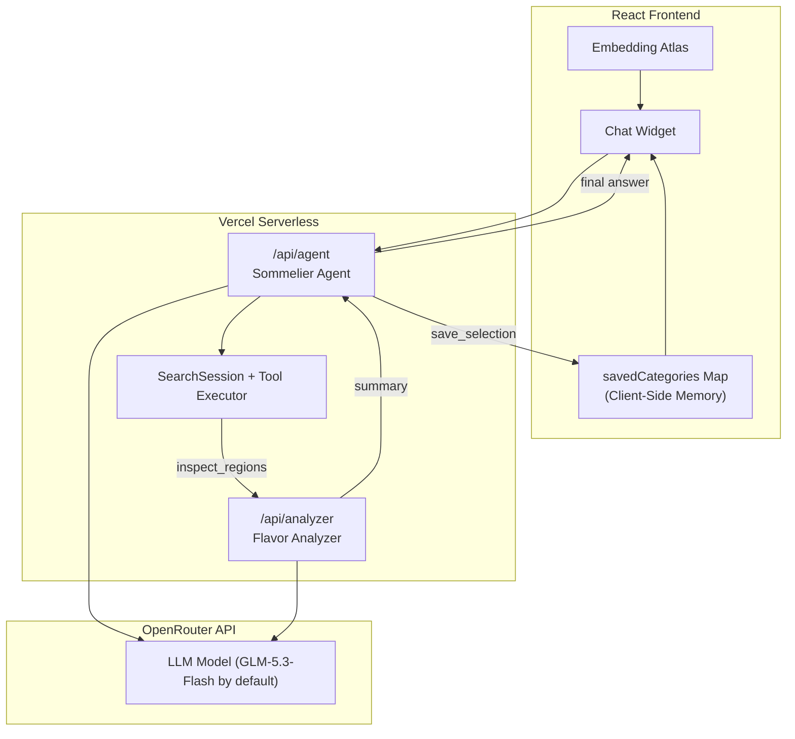
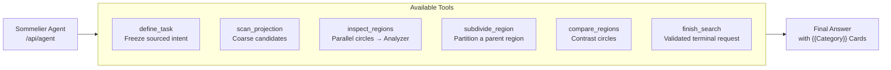
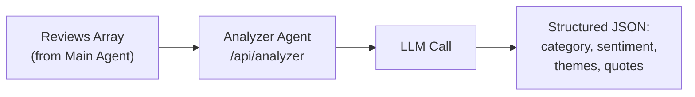

# Wine Review Atlas - Sommelier AI Agent

An interactive visualization and analysis tool for **130k Wine Reviews** using Apple's Embedding Atlas with an AI-powered Multi-Agent system.

## Sommelier Agent Demo

The web app features a sophisticated **Multi-Agent Architecture** that enables autonomous exploration of the wine landscape, acting as your personal AI Sommelier.

### Features

| Feature             | Description                                                                               |
| ------------------- | ----------------------------------------------------------------------------------------- |
| **Sommelier Agent** | **Orchestrator Agent** that understands varietals, regions, and price points              |
| **Flavor Analyzer** | **Analyzer Agent** that extracts flavor notes, acidity, tannins, and finish from clusters |
| **Agentic Search**  | Projection-guided loop: coarse grid scan → parallel circular probes → refine/compare → save |
| **Vintage Memory**  | Bookmarks interesting wines with **Category Cards** (e.g., "Earthy Tuscan Reds")          |
| **Interactive Map** | 2D semantic map of 130k wines where similar taste profiles are clustered together         |

### How It Works

1.  **Task and Scan**: The Sommelier records explicit constraints with source quotes, then proposes circles at its chosen map scale.
2.  **Parallel Circular Probes**: It places several true circular probes in one action and delegates their samples to the **Analyzer Agent**.
3.  **Adaptive Traversal**: The main Agent chooses more circles, comparison, refinement or stopping from purity, intent and text evidence.
4.  **Search Contract**: One session validates candidate provenance, immutable scope, budgets and terminal conditions. Runtime search uses XY, metadata and text without an embedding index.
5.  **Curation**: Verified reviews are saved separately from retrieval and displayed as interactive Category Cards.

The projection is treated as a candidate-generation space, not semantic ground truth. See [Projection-Guided Agentic Search](web-app/docs/PROJECTION_AGENT_SEARCH.md) for tool boundaries, geometry, stopping behavior, and evaluation hooks.

### Architecture

```mermaid
flowchart TB
    subgraph Frontend["React Frontend"]
        Atlas["Embedding Atlas"]
        Chat["Chat Widget"]
        Memory["savedCategories Map<br/>(Client-Side Memory)"]

        Atlas --> Chat
        Memory --> Chat
    end

    subgraph Backend["Vercel Serverless"]
        Orchestrator["/api/agent<br/>Sommelier Agent"]
        Analyzer["/api/analyzer<br/>Flavor Analyzer"]
        Tools["SearchSession + Tool Executor"]
    end

    subgraph LLM["OpenRouter API"]
        Model["LLM Model (GLM-5.3-Flash by default)"]
    end

    Chat --> Orchestrator
    Orchestrator --> Tools
    Tools -->|"inspect_regions"| Analyzer
    Analyzer -->|"summary"| Orchestrator
    Orchestrator --> Model
    Analyzer --> Model
    Orchestrator -->|"save_selection"| Memory
    Orchestrator -->|"final answer"| Chat
```

#### Main Agent (Sommelier)

The orchestrator agent that coordinates exploration and delegates analysis tasks.

```mermaid
flowchart LR
    subgraph Tools["Available Tools"]
        Define["define_task<br/>Freeze sourced intent"]
        Scan["scan_projection<br/>Coarse candidates"]
        Inspect["inspect_regions<br/>Parallel circles → Analyzer"]
        Refine["subdivide_region<br/>Partition a parent region"]
        Compare["compare_regions<br/>Contrast circles"]
        Finish["finish_search<br/>Validated terminal request"]
    end

    Agent["Sommelier Agent<br/>/api/agent"] --> Tools
    Tools --> Response["Final Answer<br/>with {{Category}} Cards"]
```

#### Sub-Agent (Analyzer)

A specialized sub-agent that receives review data and extracts structured insights.

```mermaid
flowchart LR
    Input["Reviews Array<br/>(from Main Agent)"] --> Analyzer["Analyzer Agent<br/>/api/analyzer"]
    Analyzer --> LLM["LLM Call"]
    LLM --> Output["Structured JSON:<br/>category, sentiment,<br/>themes, quotes"]
```

## Capabilities

- **Semantic Search**: Find wines by description (e.g., "barnyard funk", "cat pee on a gooseberry bush").
- **SQL Analytics**: Aggregate stats by price, points (80-100), country, or winery via DuckDB-WASM.
- **Cluster Inspector**: Deep dive into specific map regions to understand local styles.
- **Value Finder**: Identify high-scoring wines at low price points.

### Example Questions

- "Find me some bold red wines under $20 that taste like chocolate."
- "What are the main differences between the Pinot Noirs in the top-left vs bottom-right clusters?"
- "Show me the rating distribution for French wines."
- "I like earthy, tannic wines. What do you recommend?"

## Tech Stack

| Component     | Technology                               |
| ------------- | ---------------------------------------- |
| Visualization | Apple Embedding Atlas                    |
| Embeddings    | Qwen 3 (4B) via OpenRouter               |
| Data Engine   | DuckDB-WASM + Mosaic                     |
| Frontend      | React + TypeScript + Vite                |
| Backend       | Vercel Serverless Functions              |
| AI Agents     | Orchestrator + Analyzer (via OpenRouter) |
| Dataset       | Wine Magazine (130k reviews)             |

## Data Pipeline

The project includes a robust Python pipeline to process the raw CSV into a visualization-ready format:

1.  `1_generate_embeddings_OpenRouter.py` - Generate embeddings from wine descriptions using Nomic API.
2.  `2_reduce_dimensions.py` - Dimensionality reduction (UMAP) to project 768d vectors to 2D.
3.  `regenerate_static_export.py` - Packages the processed `winemag_projected.parquet` for the web app.

## Benchmark

The frozen `wine-par-v1` benchmark contains 30 stratified queries, seven system baselines, blind pooled-judgment protocols, trajectory conversion, and dependency-free evaluation for retrieval quality, thematic exploration, cost, and purity/intent calibration. See the [benchmark README](benchmark/README.md) and [runbook](benchmark/RUNBOOK.md).

## License

This project is licensed for **non-commercial use only**.

For commercial use, please contact the author for permission.

See [LICENSE](LICENSE) for details.
