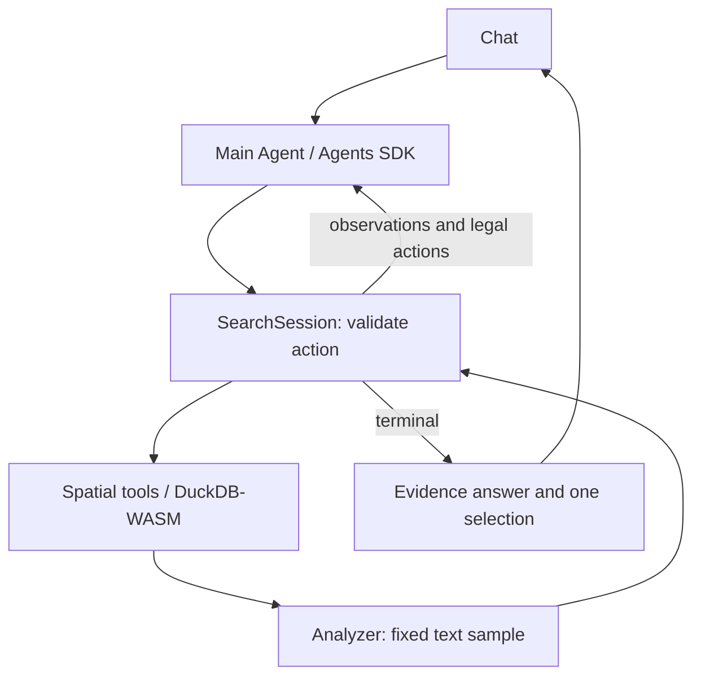

# Atlas Agent architecture

```mermaid
flowchart TD
  UI[Chat] --> SDK[Main Agent / Agents SDK]
  SDK --> Session[SearchSession: validate action]
  Session --> SQL[Spatial tools / DuckDB-WASM]
  SQL --> Analyzer[Analyzer: fixed text sample]
  Analyzer --> Session
  Session -->|observations and legal actions| SDK
  Session -->|terminal| Presenter[Evidence answer and one selection]
  Presenter --> UI
```

The main Agent chooses scan scale, circles, refinement and finish requests. SearchSession owns the only task/evidence/terminal state. The SDK runs the tool loop; no hand-written model scheduling loop is used. XY is a candidate space; text establishes semantic evidence. No embedding service or vector index is introduced.

See [the versioned search contract](PROJECTION_AGENT_SEARCH.md) for schemas, state transitions, termination and evaluation conditions. Old `SearchPolicy` and `ProjectionController` implementations were removed. Tool schemas and instructions derive from `src/agent/searchContract.ts`.

The API returns full tool results for UI cards, a policy-compatible snapshot for existing counters, the same terminal object and separated model/Analyzer usage. The model receives compact state with evidence summaries, not raw reviews or full trajectory copies. Pilot captures incremental traces.

The legacy Python pilot implements a different runtime and is retained only for historical analysis. Run the TypeScript SDK pilot for the current implementation.
