# Atlas Agent Architecture

This document provides a detailed technical overview of how the Atlas visualization widget works and how the AI agent integrates with it.

---

## System Overview


---

## Multi-Agent Architecture (NEW)

The Atlas Agent uses a **two-tier architecture** to optimize context window usage and enable scalable data exploration.


### Key Benefits:

1. **Context Efficiency**: Orchestrator never sees raw review text, only summaries
2. **Scalability**: Can analyze 10+ clusters without context overflow
3. **Token Savings**: 83% reduction (30k → 5k tokens for 5 clusters)
4. **Rich UI**: Unlimited review details via client-side hydration

---

## Agent Architecture

### Agentic Search Workflow

The Orchestrator follows a 3-phase exploration paradigm:


### Agent Loop (Updated)

```mermaid
flowchart TB
    Start([User sends message]) --> AddMsg[Add to message history]
    AddMsg --> API[POST /api/agent]
    API --> LLM{LLM Response}

    LLM -->|"tool_calls"| Execute[Execute Tools Locally]
    Execute --> SubAgent{Tool = analyze_cluster?}
    SubAgent -->|Yes| CallAnalyzer[POST /api/analyzer]
    SubAgent -->|No| LocalExec[Local DuckDB query]
    CallAnalyzer --> Results[Collect Tool Results]
    LocalExec --> Results
    Results --> Memory{Tool = save_reviews?}
    Memory -->|Yes| UpdateMap[Update savedCategories Map]
    Memory -->|No| API
    UpdateMap --> API

    LLM -->|"content"| Hydrate[Hydrate {{CATEGORY}} placeholders]
    Hydrate --> Display[Display Response]
    Display --> End([Done])

    subgraph Iteration["Iteration Limit"]
        Counter["Max 30 iterations<br/>Wrap-up hint at step 27"]
    end

    Execute --> Counter
    Counter -->|"< 30"| API
    Counter -->|">= 30"| ForceEnd[Force final response]
    ForceEnd --> Display
```

---

## New Tools (Multi-Agent)

### analyze_cluster

**Purpose**: Delegate cluster analysis to Analyzer Agent

**Parameters**:

- `bin_x`, `bin_y`: Cluster coordinates (from FLOOR(projection_x/bin_size))
- `bin_size`: Binning resolution (default: 1.0)
- `sample_size`: Number of reviews to analyze (default: 10, max: 80)

**Execution Flow**:

1. ToolExecutor queries DuckDB for reviews in bin
2. Sends reviews to `/api/analyzer`
3. Analyzer Agent (LLM) extracts themes, sentiment, quotes
4. Returns structured summary (not raw reviews)

**Output**:

```typescript
{
  category: "Noise Complaints",
  sentiment: "Negative",
  themes: ["loud AC", "thin walls", "street noise"],
  quotes: ["The AC was unbearably loud", ...],
  avg_rating: 1.9,
  review_ids: [1023, 1045, ...],
  count: 10,
  reviews: [  // Full reviews array (5-80 samples)
    { id: 1023, rating: 1, text: "The AC was unbearably loud..." },
    { id: 1045, rating: 2, text: "Couldn't sleep due to noise..." },
    // ... up to 80 reviews
  ]
}
```

### save_reviews

**Purpose**: Bookmark verified reviews for final answer

**Parameters**:

- `review_ids`: Array of `__row_index__` values
- `category`: Category label (e.g., "Cleanliness Issues")

**Behavior**:

- Extracts **complete data** from recent `analyze_cluster` results
- Stores in client-side `savedCategories` Map including:
  - Summary metadata (category, sentiment, themes, quotes)
  - **Full reviews array** (5-80 samples with original text)
- Does NOT re-inject review data into Orchestrator context (keeps it lightweight)

**Usage in Answer**:

```markdown
I found two issues: {{Noise Complaints}} and {{Cleanliness Issues}}
```

UI auto-expands to rich cards showing:

- Summary: category, sentiment, themes, average rating
- **Full review list**: All 5-80 samples with ratings and original text (scrollable)

---

## Category Card Rendering

### Placeholder Detection

**Regex**: `/\{\{([^}]+)\}\}/g`  
Matches: `{{Any Text Including Spaces & Symbols}}`

### Rendering Logic

```typescript
// In App.tsx Message component
const categoryData = savedCategories.get("Noise Complaints");

if (categoryData && categoryData.length > 0) {
  const data = categoryData[0];
  const reviews = data.reviews || [];

  return (
    <div className="category-card">
      <h4>📦 {data.category}</h4>
      <p>Sentiment: {data.sentiment} | Avg: {data.avg_rating}★ | Samples: {reviews.length}</p>
      <p><strong>Themes:</strong> {data.themes.join(', ')}</p>

      {/* Display all review samples */}
      <div style={{ maxHeight: '400px', overflowY: 'auto' }}>
        {reviews.map((review, idx) => (
          <div key={idx} className="review-item">
            <strong>Review #{idx + 1} - {review.rating}★</strong>
            <p>{review.text || review.description}</p>
          </div>
        ))}
      </div>
    </div>
  );
}
```

---

## API Endpoints

### POST /api/agent (Orchestrator)

**Request**:

```json
{
  "messages": [{ "role": "user", "content": "What are the complaints?" }]
}
```

**Response** (Tool Calls):

```json
{
  "type": "tool_calls",
  "tool_calls": [
    {
      "function": {
        "name": "analyze_cluster",
        "arguments": "{\"bin_x\": 3, \"bin_y\": 10, \"sample_size\": 20}"
      }
    }
  ]
}
```

**Response** (Final Answer):

```json
{
  "type": "response",
  "content": "I found these issues: {{Noise}} and {{Cleanliness}}"
}
```

### POST /api/analyzer (Analyzer Agent - NEW)

**Request**:

```json
{
  "bin_x": 3,
  "bin_y": 10,
  "bin_size": 1.0,
  "reviews": [
    { "id": 1023, "rating": 1, "text": "The AC was unbearably loud..." },
    { "id": 1045, "rating": 2, "text": "Couldn't sleep due to noise..." }
  ]
}
```

**Response**:

```json
{
  "category": "Noise Complaints",
  "sentiment": "Negative",
  "themes": ["loud AC", "thin walls", "street noise"],
  "quotes": ["The AC was unbearably loud"],
  "count": 2,
  "avg_rating": 1.5,
  "review_ids": [1023, 1045],
  "bin_x": 3,
  "bin_y": 10
}
```

---

## Memory Management

### savedCategories State

```typescript
interface AgentState {
  savedCategories: Map<string, CategoryData[]>;
  // Example:
  // Map {
  //   "Noise Complaints" => [{
  //     category, sentiment, themes, quotes, avg_rating,
  //     review_ids: [1023, 1045, ...],
  //     reviews: [  // Full review objects with text
  //       { id: 1023, rating: 1, text: "..." },
  //       { id: 1045, rating: 2, text: "..." }
  //     ]
  //   }],
  //   "Cleanliness Issues" => [...]
  // }
}
```

### Context Pruning Strategy

**Current**: Full conversation history retained  
**Future**: Aggressive pruning of tool outputs after processing

**Workflow**:

1. Analyzer returns summary → Orchestrator processes
2. Prune raw review data from history
3. Keep only summary in context
4. UI hydrates details client-side from `savedCategories`

---

## Tool Definitions (Complete List)


---

## File Structure (Updated)

```
web-app/
├── api/
│   ├── agent.ts             # Orchestrator Agent with tools
│   └── analyzer.ts          # Analyzer Agent (NEW)
│
├── src/
│   ├── App.tsx              # Main component + Category Card rendering
│   ├── App.css              # Styles
│   │
│   ├── hooks/
│   │   └── useAgentChat.ts  # Agent loop + savedCategories state
│   │
│   └── tools/
│       └── toolExecutor.ts  # All tool implementations
│
├── docs/
│   ├── ARCHITECTURE.md      # This file
│   └── ROADMAP.md           # Feature roadmap
│
├── public/
│   └── atlas/data/
│       └── dataset.parquet  # Review embeddings
│
└── vercel.json              # Deployment config
```

---

## Security Model

```mermaid
flowchart TB
    subgraph Client["Client (Browser)"]
        UI["User Interface"]
        Tools["Tool Executor"]
        Memory["savedCategories<br/>(local state)"]
    end

    subgraph Server["Server (Vercel)"]
        Orchestrator["/api/agent"]
        Analyzer["/api/analyzer"]
        Key["API Key<br/>(env variable)"]
    end

    subgraph External["External"]
        LLM["OpenRouter API"]
    end

    UI -->|"No secrets"| Orchestrator
    Orchestrator -->|"Authenticated"| LLM
    Analyzer -->|"Authenticated"| LLM
    Key -.->|"Injected"| Orchestrator
    Key -.->|"Injected"| Analyzer

    Tools -->|"SELECT only"| DB[(DuckDB)]
    Memory -.->|"Client-side only"| UI

    subgraph Protections["Security Measures"]
        p1["✓ API key server-side only"]
        p2["✓ SQL injection prevention"]
        p3["✓ Query result limits (80 rows/cluster)"]
        p4["✓ Iteration limits (30 max)"]
        p5["✓ Context size limits (100k chars)"]
        p6["✓ No raw PII in Orchestrator context"]
    end
```



---

## Performance Considerations

| Component          | Strategy                      | Performance             |
| ------------------ | ----------------------------- | ----------------------- |
| Parquet Loading    | Single fetch, browser cached  | ~1-2s initial load      |
| DuckDB Queries     | In-memory, ~10-50ms per query | Very fast               |
| Atlas Rendering    | WebGL, handles 100k+ points   | 60 FPS                  |
| Orchestrator LLM   | 1-3s per request              | Model dependent         |
| Analyzer LLM       | 1-2s per cluster              | Parallelizable (future) |
| Tool Execution     | Local, <100ms per tool        | Instant                 |
| Category Hydration | Client-side Map lookup        | <1ms                    |

### Multi-Agent Performance Impact

**Sequential Execution** (current):

- 5 clusters × (query 50ms + analyzer 2s) = ~10s

**Parallel Execution** (future):

- 5 clusters × max(2s analyzer) = ~2s
- **5x speedup** potential

---

## Atlas Widget Internals

The `EmbeddingAtlas` component from Apple handles visualization and interaction.


### Atlas State Object

When `onStateChange` fires, it provides:

```typescript
interface AtlasState {
  predicate: string | null; // SQL WHERE clause for selection
  // e.g., "__row_index__ IN (1, 2, 3, ...)"
}
```

### Highlight Integration (NEW)

The `highlight` prop accepts an array of IDs to visually emphasize on the map:

```typescript
<EmbeddingAtlas
  coordinator={c}
  data={...}
  highlight={highlightIds}  // e.g., [1023, 1045, 1067]
/>
```

**Use Case**: When Agent analyzes a cluster, the review IDs are highlighted on the map for visual feedback.

---

## Data Flow


---

## Context Management


---

## Future Enhancements

### Parallel Tool Execution

- Run multiple `analyze_cluster` calls concurrently
- Batch state updates for `save_reviews`
- 3-5x speedup for multi-cluster queries

### Context Pruning

- Aggressively remove tool outputs after processing
- Keep only lightweight summaries in history
- Enable 50+ step explorations

### Enhanced Category Cards

- Click to expand → show full review text
- On-demand DuckDB fetch using stored `review_ids`
- Add charts (sentiment distribution, word clouds)
- Export to CSV

### Semantic Search Integration

- Add `semantic_search(query, top_k)` tool
- Call Nomic Embed API for query embedding
- Cosine similarity search in DuckDB (needs vector extension)

---

**Last Updated**: 2026-02-07  
**Version**: Multi-Agent Architecture v2.0
